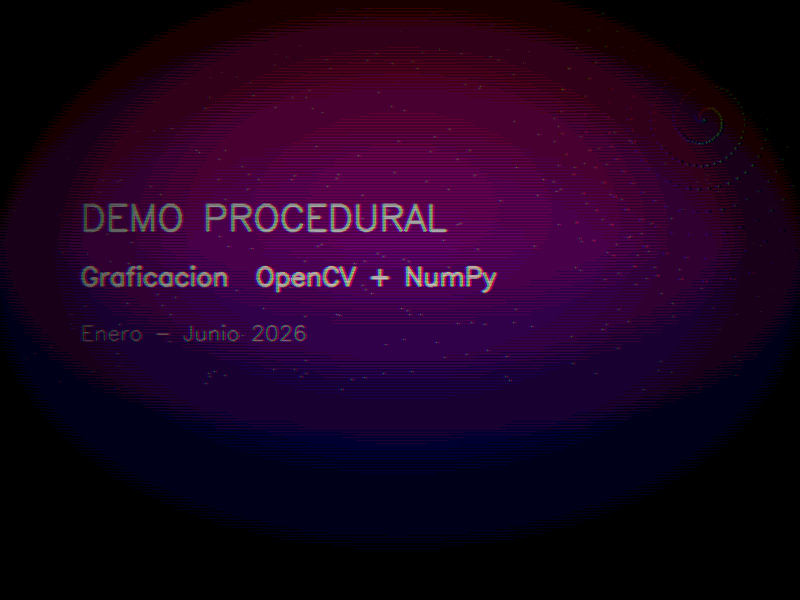
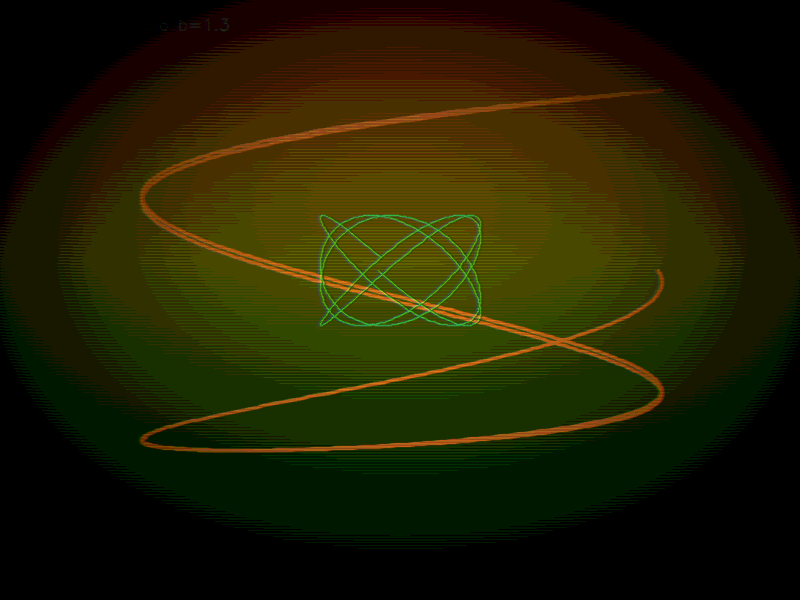
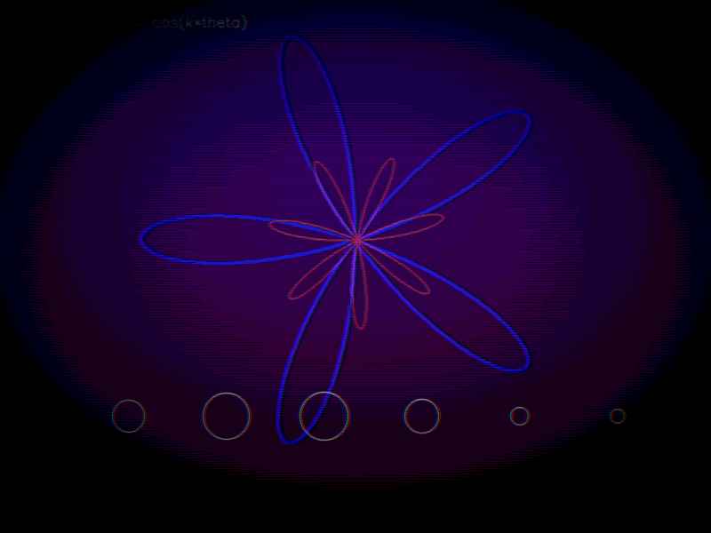
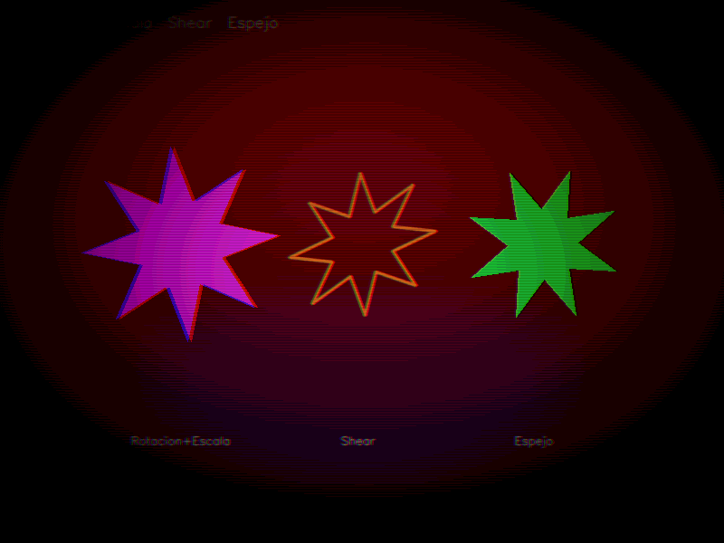
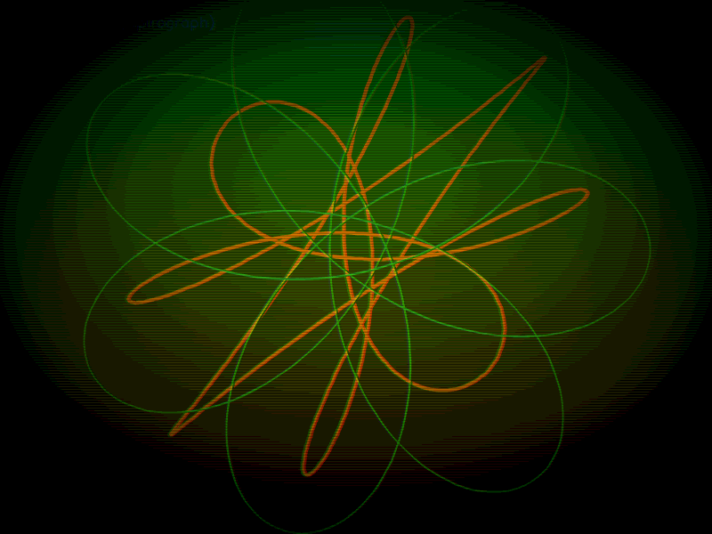
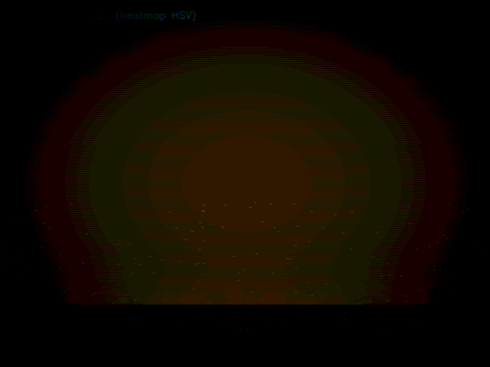

# Proyecto Final: Demo Procedural con OpenCV

**Nombre:** Salto Salgado Diego
**Grupo:** B 
**Materia:** Graficación — Enero Junio 2026  

---

## 1. Objetivo de la práctica
Construir un demo procedural de 60 segundos usando únicamente Python 3, NumPy y OpenCV. El objetivo es generar todo el entorno visual en tiempo real mediante ecuaciones paramétricas y algoritmos, sin depender de texturas externas ni modelos descargados. El demo debe exhibir el dominio de curvas matemáticas animadas, transformaciones afines sobre primitivas de dibujo y efectos de post-procesamiento visual, todo organizado en seis escenas controladas por una línea de tiempo (timeline).

---

## 2. Capturas de pantalla
*A continuación se muestran los fotogramas clave generados proceduralmente para cada escena:*

### Escena 0: Credits / Intro

### Escena 1: Lissajous

### Escena 2: Rosa Polar

### Escena 3: Transformaciones Afines

### Escena 4: Spirograph (Hipotrocoide)

### Escena 5: Fuego Procedural

---

## 3. Tabla comparativa de resultados

| Requisito | Implementado en el código | Efecto Visual Obtenido |
| :--- | :--- | :--- |
| **Escenas** | 6 escenas controladas por bloque de tiempo `t` | Transiciones fluidas (crossfade) cada 10 segundos. |
| **Curvas paramétricas** | Lissajous, Rosa Polar, Espiral, Hipotrocoide (Spirograph) y Lemniscata | Formas orgánicas que mutan de tamaño y forma en el tiempo sin usar assets. |
| **Transformaciones** | Matriz afín 2x3 (Rotación, Escala, Shear, Espejo) | Estrellas en la Escena 3 girando, pulsando, sesgándose y reflejándose simétricamente. |
| **Primitivas OpenGL/CV** | `cv2.polylines`, `cv2.fillPoly`, `cv2.circle`, `cv2.rectangle` | Construcción de las figuras geométricas base píxel a píxel. |
| **Post-procesamiento** | Vignette, Scanlines CRT, Posterize y Aberración Cromática | Estética retro/cinemática, limitación de colores (posterize) y bordes desenfocados. |

---

## 4. Reporte Técnico (Matemáticas y Algoritmos)

### Timeline y Transiciones
El avance de la aplicación no requiere interacción del usuario. Se determinó el uso de una función `smoothstep` para interpolar la transición (alpha) entre un `bufA` y un `bufB` usando `cv2.addWeighted`, logrando un "crossfade" matemático.

### Ecuaciones Paramétricas Destacadas
1. **Lissajous (Escena 1):** `x(t) = sin(a·t + δ)`  
   `y(t) = sin(b·t)`  
   *(Los parámetros a y b cambian en el tiempo mediante funciones seno/coseno para animar la curva).*

2. **Rosa Polar (Escena 2):** `r(θ) = cos(k·θ)` *(k=5 y k=7 para superposición)* `x(θ) = r·cos(θ + θ₀)`  
   `y(θ) = r·sin(θ + θ₀)`

3. **Hipotrocoide / Spirograph (Escena 4):** `x(t) = (R-r)·cos(t) + d·cos((R-r)/r · t)`  
   `y(t) = (R-r)·sin(t) - d·sin((R-r)/r · t)`

### Transformaciones Implementadas (Escena 3)
Se aplicó una matriz de transformación afín `M` (2x3) que multiplica los vectores de posición de las primitivas:
* **Rotación + Escala:** Combinación de escalado `s` pulsante y rotación `α`.
* **Shear (Cizallamiento):** Modificación de los componentes fuera de la diagonal en la matriz para inclinar la figura en el eje X en función del tiempo.
* **Espejo:** Inversión del signo en la coordenada X (`x' = -x`).

---

## 5. Respuestas a las preguntas de análisis

* **¿Qué curva paramétrica fue más compleja de implementar y por qué?**
  El Hipotrocoide (Spirograph) de la Escena 4 requirió mayor ajuste algorítmico. A diferencia de un círculo simple, requiere balancear tres parámetros distintos (R: radio mayor, r: radio menor, d: distancia del punto) y calcular un dominio lo suficientemente amplio (ej. `14 * math.pi`) con una gran cantidad de puntos de muestreo lineal (`np.linspace`) para garantizar que la curva se cierre visualmente sobre sí misma de forma suave.

* **¿Cómo afectó el filtro de post-procesamiento al rendimiento (FPS)?**
  Añadir múltiples filtros sobre la matriz completa de píxeles (Vignette, Scanlines, Posterize y Aberración Cromática) impacta el procesamiento. Sin embargo, al utilizar operaciones matriciales vectorizadas de la librería NumPy (como `np.mgrid` para la viñeta o cortes de arreglos `img[:, shift:, 2]` para la aberración) en lugar de bucles `for` anidados nativos de Python, se logró minimizar el cuello de botella en CPU, manteniendo el objetivo cercano a los 30 FPS.

---

## 6. Conclusión final
El desarrollo de este demo comprueba que es posible construir un mundo visual inmersivo apoyándose exclusivamente en matemáticas computacionales y primitivas de dibujo. La combinación de curvas trigonométricas permite la generación de geometrías orgánicas complejas, mientras que el álgebra lineal (matrices de transformación) otorga vida y movimiento a dichos vértices. Finalmente, aplicar manipulación de matrices a nivel de píxel (post-procesamiento) demuestra cómo el tratamiento matemático global de una imagen puede alterar drásticamente la dirección de arte y la estética de un renderizado en tiempo real, todo sin depender de motores gráficos externos ni assets precargados.
